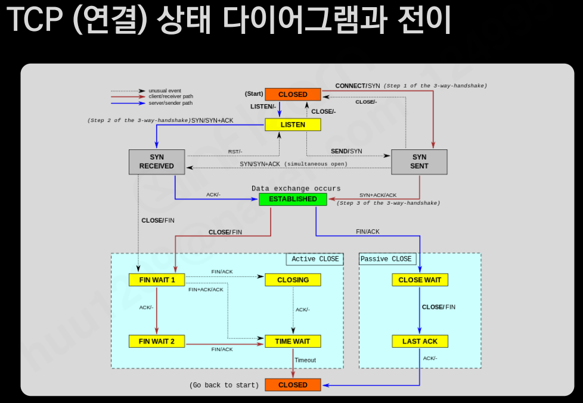

# TCP

TCP는 연결지향 통신으로 데이터를 전송하는 측과 데이터를 전송받는 측에서 전용의 데이터 전송 선로를 만든다.
  
그럼으로 TCP는 안정적이다.
  
3-Way handshake을 통해 클라이언트와 서버간의 통신 연결이 이루어진다.
  
### TCP연결 상태 전이
  

## TCP Echo 서비스 작동 순서

서버측에서 socket() 함수를 통해 파일은 Open하고
bind() 함수를 통해 TCP 프로토콜 정보를 파일에 붙혀준다.
(IP Addr + Port 정보, 포트번호는 1~65534값까지 사용가능한데 특정 프로세스에 유일해야만한다)
listen() 함수를 통해 대기 상태로 들어간 후 클라이언트 작업을 기다린다.

클라이언트에서는 socket() 함수를 통해 Open하고 connect함수를 하는데 
서버가 이미 listen()까지 끝낸 대기 상태라면 서버 측에서 accept() 함수가 호출되게된다.

이후 통신이 연결되어 recv(), send() 함수를 주고 받다 클라이언트 측에서
shutdown()함수를 호출하게 되면 통신을 끊기위한 절차를 진행하게된다.

